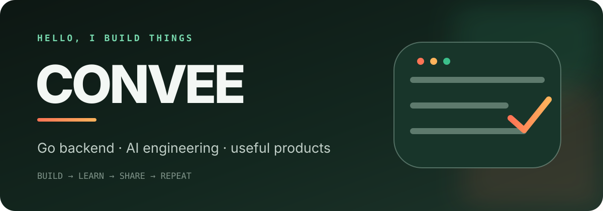
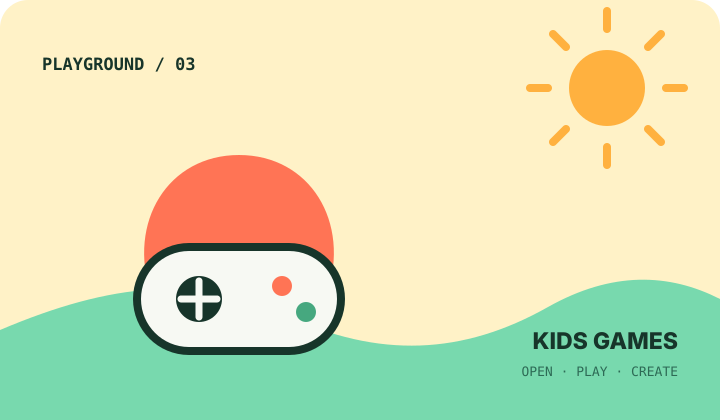

  

## 你好，我是 Convee 👋

我是一名持续构建的后端工程师，长期使用 **Go** 打磨 Web 服务、内容系统与工程工具，也在探索 **AI Agent、自动化研究与知识工程**。

我喜欢把想法做成真正可以打开、运行和继续迭代的产品。最近的工作集中在：

- 用 Go 构建稳定、清晰、易维护的后端系统
- 把 AI 信息采集、证据追踪与内容生产做成自动化工作流
- 为真实使用场景制作简单、有趣、零负担的小产品

## Featured work

  
  
  

### [Go Markdown Blog](https://github.com/convee/goblog)

一个使用 Go、MySQL 与服务端模板实现的轻量 Markdown 博客系统，包含内容管理、搜索和安全后台。适合从完整项目中了解 Go Web 应用的组织方式。

`Go` `MySQL` `Markdown` `Elasticsearch`

### [Daily Content Archive](https://github.com/convee/daily-content-archive)

跨平台的每日内容归档工具，持续收集 Hacker News、X / Twitter、Reddit 与 Product Hunt 的高价值内容，并保留可追溯来源。

`Python` `AI Research` `Automation` `Evidence-first`

### [小小游戏乐园](https://github.com/convee/kids-games)

为小朋友制作的浏览器小游戏合集。每个游戏都是单文件、零依赖，打开网页就能玩，也方便学习和二次创作。

`HTML` `CSS` `JavaScript` `Zero dependency`

## What I work with

| 方向 | 工具与实践 |
| --- | --- |
| Backend | Go · REST API · MySQL · Redis · Elasticsearch |
| AI Engineering | Agent · RAG · 自动化研究 · 评测与可观测 |
| Frontend | JavaScript · Vue · HTML/CSS |
| Delivery | Docker · GitHub Actions · Linux · GitOps |

## Find me

- 🌐 [convee.cn](https://convee.cn) — AI 工程情报与知识系统
- 💻 [GitHub Projects](https://github.com/convee?tab=repositories) — 查看全部开源项目

  Build useful things. Keep learning. Share the process.

