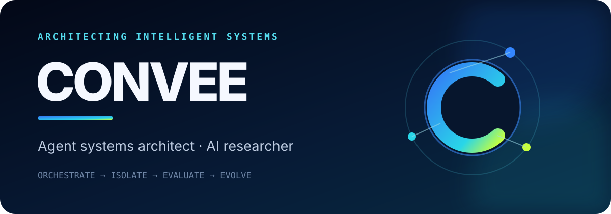
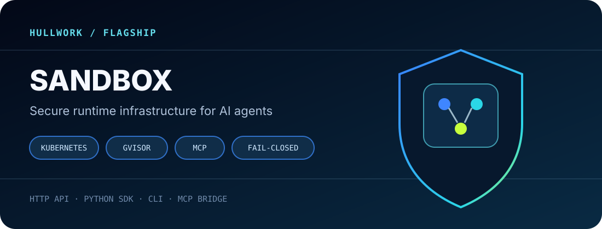
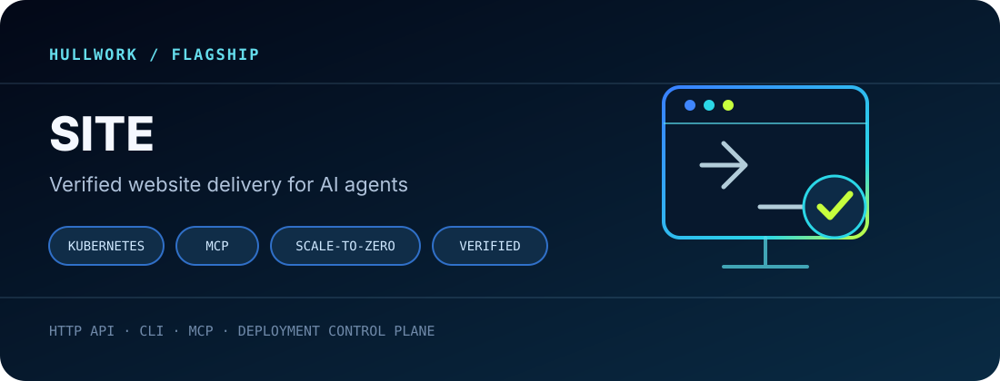
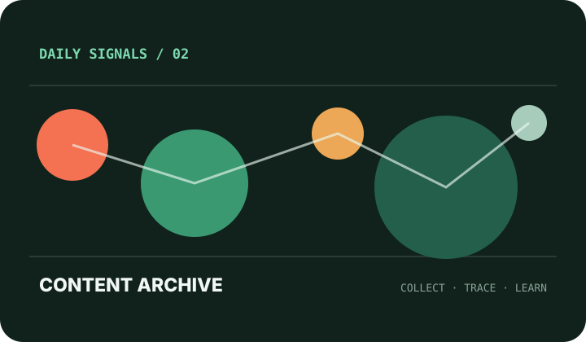
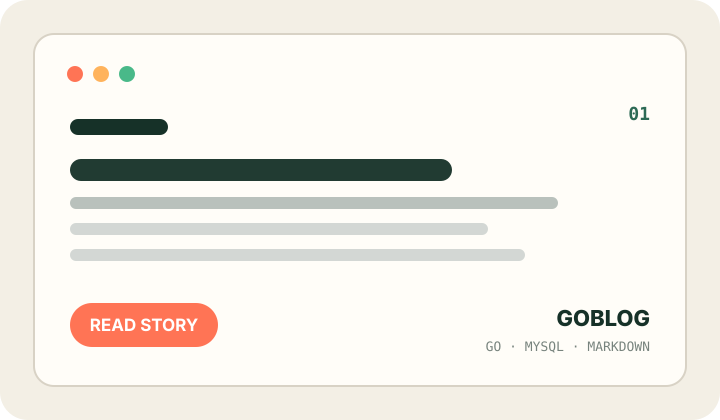

  

## Hi, I'm Convee 👋

I design and build **AI agent systems**, with a focus on architecture, secure execution, evaluation, and the engineering required to turn model capabilities into dependable products. I also research reasoning, tool use, context and memory, and the boundaries of current AI systems.

> **An agent is not a model call. It is a system of models, tools, state, runtimes, permissions, evaluations, and feedback loops.**

I am particularly experienced in:

- **Agent Architecture** — multi-agent collaboration, task orchestration, tool routing, context and memory, human-in-the-loop workflows
- **Secure Runtime** — isolated execution, workspace lifecycle, multi-tenant authorization, quotas, and failure containment
- **Evaluation & Observability** — reproducible evals, tracing, failure guards, and quality/cost feedback loops
- **AI Research** — evidence-first discovery, source tracing, knowledge engineering, and automated research workflows

## Flagship projects

  

### [hullwork/sandbox](https://github.com/hullwork/sandbox) — Secure runtime for AI agents

A self-hosted execution sandbox for AI agents. Each runtime runs in its own Kubernetes `gVisor` Pod, while the control plane manages workspaces, tenant authorization, quotas, credentials, and lifecycle. It is accessible through an HTTP API, Python SDK, CLI, and MCP bridge.

The project is concerned not only with *running code*, but with **where an agent runs, what it can access, how it recovers from failure, and how the system preserves its security boundaries**.

`Kubernetes` `gVisor` `Python` `MCP` `Multi-tenant` `Fail-closed`

  

### [hullwork/site](https://github.com/hullwork/site) — Verified website delivery for AI agents

A deployment control plane that lets an AI agent ship a website to Kubernetes through HTTP, CLI, or MCP. It handles tenant admission, quotas, desired state, builds, workloads, ingress, observability, and scale-to-zero activation.

The system treats deployment as a claim that must be proven: once a workload is ready, the control plane makes a real HTTP request and records the response status and body digest. **“Deployed” is a measurement, not an exit code.**

`Kubernetes` `Python` `MCP` `Multi-tenant` `Scale-to-zero` `HTTP verification`

## Architecture & research

| Area | Questions I work on |
| --- | --- |
| Agent systems | How should planners, executors, tools, memory, and feedback loops compose into systems that can recover and evolve? |
| Runtime & security | How can untrusted code run in isolation with least-privilege identity, resource, and network boundaries? |
| Evaluation | How can traces, offline evals, production signals, and failure analysis form a continuous improvement loop? |
| AI research | How can evidence-first collection, source tracing, synthesis, and knowledge capture produce trustworthy research? |
| Engineering | How can Go, Python, Kubernetes, Docker, and GitOps turn architecture into operable systems? |

## More builds

  
  

### [Daily Content Archive](https://github.com/convee/daily-content-archive)

An automated research and content archive that continuously collects high-value signals, preserves traceable sources, and turns scattered information into reusable research material.

### [Go Markdown Blog](https://github.com/convee/goblog)

A lightweight Markdown publishing system built with Go, MySQL, and server-rendered templates, including content management, search, and a secure admin surface.

## Find me

- 🌐 [convee.cn](https://convee.cn) — AI engineering intelligence and knowledge systems
- 🧩 [hullwork/sandbox](https://github.com/hullwork/sandbox) — secure execution infrastructure for agents
- 🚀 [hullwork/site](https://github.com/hullwork/site) — verified website delivery for agents
- 💻 [GitHub Projects](https://github.com/convee?tab=repositories) — more open-source work

  Architect the system. Ground it in evidence. Ship what works.

